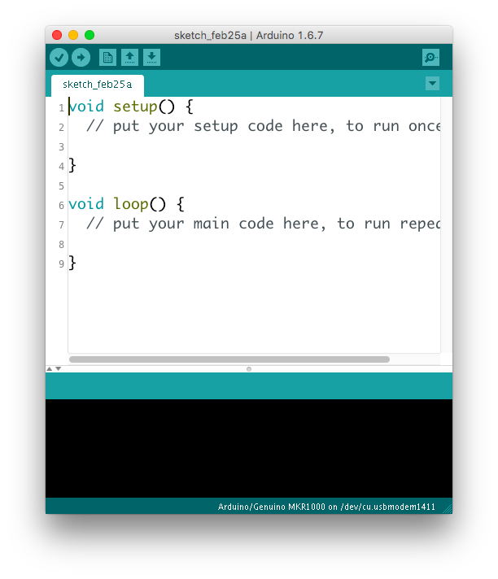
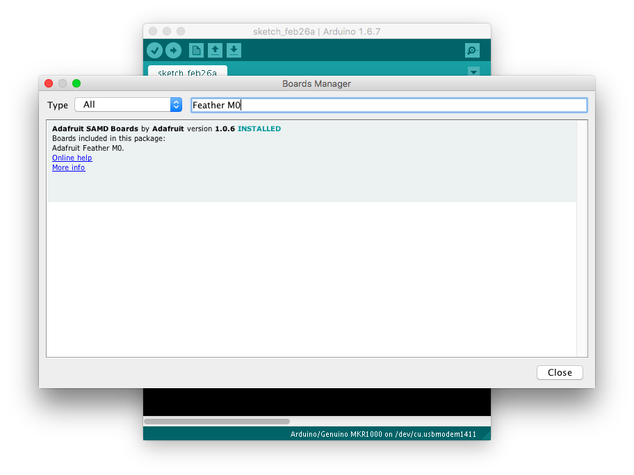
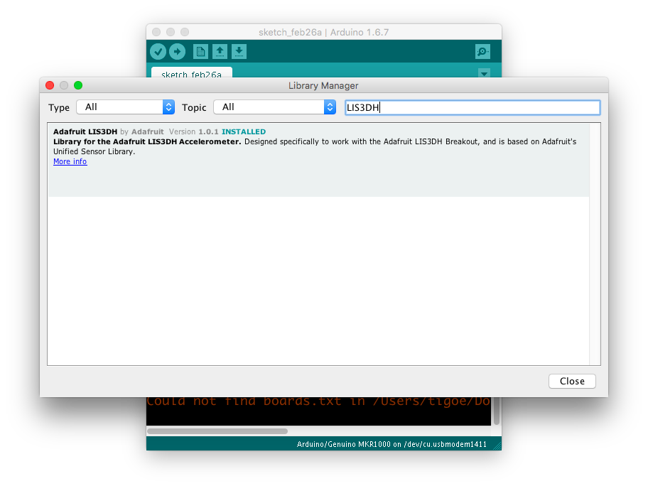

# Introduction to Sensors for Journalism

In this workshop, you'll learn how we measure events and conditions in the physical world using electronic systems. Although this won't be comprehensize, you'll get an introduction to the process that they know where to investigate further if they want to critique the process in an informed way.

Events in the physical world such as human movement, weather changes, or man-made environmental impacts like off-gassing from manufactured materials, generate changes in physical energy. Sensor-based data collection is  grounded in the process of _transduction:_ the conversion of other forms of physical energy into electrical energy.

The transduction process has limits: how sensitive our instruments are, how lossless our programming algorithms are, etc. Therefore, all electronic data about the events we’re sensing form models based on this collected data. Whether you’re gathering this data, analyzing it, or critiquing the process, you'll understand better how these models are formed if you understand how sensor-based data collection works.

### Workshop Schedule

  Here's the workshop schedule. We'll modify this depending on everyone's prior experience:

  * Introductions
  * Why use sensors in journalism
  * Electrical properties and relationships
  * Microcontrollers and how to program them
    * Digital input and output
    * Analog input and output
    * Serial communication between computers
    * Sensors!
    * Saving Data to a file via serial communication
    * Saving Data to an SD card
    * Real-time Clocks
  * Projects: plan and execute your own datalogging project

  We'll cover most of the technical material in the first day, so that on the second day you can deploy your datalogging project,  gather some results, and present them at the end of the day.

_To prepare for the workshop, please read through the Background material below and download the Arduino IDE software for your computer, shown in the Getting Started section below._

### Background Material

This workshop is based on material from the [introduction to physical computing course](http://itp.nyu.edu/physcomp) at [ITP](http://itp.nyu.edu). The site for that course contains a large body of explanatory notes, videos, and example exercises that you will find useful as background for this workshop.

The examples for this workshop are programs written using the [Arduino microcontroller programming environment](http://www.arduino.cc). Arduino is designed to give users with no technical background an introduction to programming microcontrollers, the small, simple computers inside many of the electronic devices in everyday life. The application that you'll download is known as an _integrated development environment_, or _IDE_.

Here are some of the technical concepts we'll cover, with links for background reading or viewing:

  * How to program a computer, [using the Arduino programming environment](https://www.arduino.cc/en/Guide/HomePage). If you're totally new to programming, here are a few helpful links:
    
      *  [Programming Terms and Programming Environments](https://itp.nyu.edu/physcomp/lessons/programming/programming-terms-and-programming-environments/) 
      * [A bit more on variables](https://itp.nyu.edu/physcomp/lessons/programming/variables/)
    
  
  * The [basic electrical properties of voltage, current, and resistance](https://itp.nyu.edu/physcomp/lessons/electronics/electricity-the-basics/), and how they are related (here's a [hands-on introduction](https://itp.nyu.edu/physcomp/labs/labs-electronics/electronics/))
  * <a href="https://itp.nyu.edu/physcomp/lessons/microcontrollers/microcontrollers-the-basics/">What microcontrollers are and how they are used
    * [Digital input and output](https://itp.nyu.edu/physcomp/lessons/microcontrollers/digital-input-output/) (here's a [step-by-step example](https://itp.nyu.edu/physcomp/labs/labs-arduino-digital-and-analog/digital-input-and-output-with-an-arduino/))
    * Analog [input](https://itp.nyu.edu/physcomp/lessons/microcontrollers/analog-input/) and [output](https://itp.nyu.edu/physcomp/lessons/microcontrollers/analog-output/) (here are step-by-step examples for [input](https://itp.nyu.edu/physcomp/labs/labs-arduino-digital-and-analog/analog-in-with-an-arduino/) and [output]())
    * [Serial communications input and output](https://itp.nyu.edu/physcomp/lessons/serial-communication/serial-communication-the-basics/) (here's a [step-by-step example](https://itp.nyu.edu/physcomp/lab-intro-to-serial-communications/))
      * [Interpreting serial data](https://itp.nyu.edu/physcomp/lessons/serial-communication/interpreting-serial-data/)
    * [Synchronous Serial Communication](https://itp.nyu.edu/physcomp/lessons/serial-communication/synchronous-serial-communication-the-basics)

These links will be useful for reference:

  * [The Arduino programming language reference](https://www.arduino.cc/en/Reference/HomePage)
  * [Arduino tutorial pages](https://www.arduino.cc/en/Tutorial/HomePage)
  * [Introduction to the Feather M0 Adalogger](https://learn.adafruit.com/adafruit-feather-m0-adalogger/)
  * [Guide to the LIS3DH accelerometer](https://learn.adafruit.com/adafruit-lis3dh-triple-axis-accelerometer-breakout?view=all)
  * [Guide to the MaxSonar LV EZ0 ultrasonic distance sensor](http://maxbotix.com/documents/LV-MaxSonar-EZ_Datasheet.pdf)
  * [Guide to the DHT11 sensor](https://learn.adafruit.com/dht)
  * [Guide to the PIR motion sensor](https://learn.adafruit.com/pir-passive-infrared-proximity-motion-sensor?view=all)
  * [Guide to the GA1A12S202 Log-scale light sensor](https://learn.adafruit.com/adafruit-ga1a12s202-log-scale-analog-light-sensor?view=all)

### Getting Started

To get started, you'll need to download and install the [download the Arduino IDE version 1.6.7](https://www.arduino.cc/en/Main/Software") or later.  All of the microcontroller examples for this workshop can be programmed using the Arduino IDE. You'll also need to install the board definition for the [Feather Adalogger M0 board](https://www.adafruit.com/products/2796) using the Boards Manager in the IDE. You'll also need to install a library or two using the Library Manager as well. This section explains how to do that, for IDE version 1.6.7.

  Here's what it looks like:

  
_Figure 1. Arduino IDE Screenshot_

#### The Boards Manager

There are more Arduino-compatible boards on the market than are listed in the IDE when you download it. To use a third-party board like the one used in this workshop, you'll need to install it using the Boards Manager. To install new board definitions click on the Tools menu, and choose Board... --> Boards Manager. Use the search bar to search for your board. If it's there, install it, then close the Boards Manager, and you should see your board show up in the Boards menu when you click on it next.


_Figure 2. The Boards Manager. You can find your board faster by filtering with its name, as shown here._

If your board is not listed in the boards manager, you'll need to add the repository for it to the Preferences. Click on the Arduino menu, choose Preferences, and look for the field caled Additional Boards Manager URLs. Click the button to the right of it and add your board's repository URL to the list. is the URL for the Feather Adalogger M0 board: 
````
https://adafruit.github.io/arduino-board-index/package_adafruit_index.json
````


_Figure 3. Detail of the Preferences pane Additional URLs field_


Once you've added your URL, click OK to exit the Preferences menu and restart the IDE. Your board should show up in the Boards Manager now, and you can install it as explained above.

#### The Library Manager

You can find installed libraries under the Sketch menu, Include Libraries option. You can find examples for them in the File Menu, Examples option.

To install new libraries that don't come standard with the IDE, click on the Sketch menu, and choose Include Library... --> Manage Libraries. Use the search bar to search for your library. If it's there, install it, then close the Library Manager, and you should see your Library show up in the Sketch --> Include Library menu and the File --> Examples menu when you click on either of them next.


_Figure 4. The Library manager. You can filter for particular libraries, like you can in the Boards Manager_

If your library is not listed in the library manager, you can add it as a folder or .zip file using the Sketch --> Include library option as well. Just click Add .ZIP Library and follow the directions from there.

Some of the examples in this repository use the following libraries. You can filter for these in the Library manager:

  * Adafruit LIS3DH accelerometer
  * RTCZero Real-Time Clock
  * FrequencyMeter
  * SD (this is installed automatically with the IDE download)

Once you've got your board installed and the libraries it needs, you're ready to use the examples in this repository. Circuit diagrams and the pin diagram of the feather can be found at [this link](feather-m0-adalogger.md).